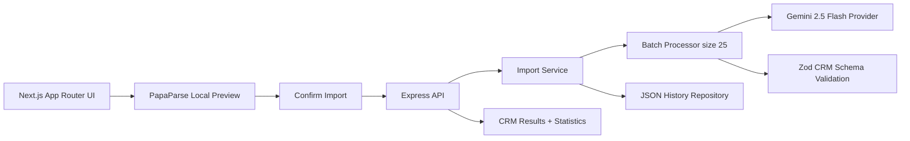

# GrowEasy AI CRM Importer

A production-style AI SaaS application for importing arbitrary CSV lead exports into the GrowEasy CRM schema. The app previews CSVs locally, confirms with the user before AI processing, batches records through Gemini 2.5 Flash, validates the CRM output, tracks import history, and exports cleaned data.

## Features

- Drag and drop CSV upload with local PapaParse preview
- GrowEasy-style Lead Sources UI with modal upload and table preview
- Express backend with clean controller, route, service, repository, validator, prompt, middleware, config, utility, and type layers
- Gemini 2.5 Flash provider with retry, timeout, batch size 25, partial success, and strict Zod validation
- Gemini response repair plus local semantic fallback when the provider fails, so imports remain usable during API outages or key issues
- Results dashboard with imported, skipped, failed, success rate, processing time, batch timeline, and export JSON/CSV
- Estimated AI tokens, average batch time, request IDs, and provider mode surfaced for production debugging
- Import history persisted to a JSON repository
- Dark mode, responsive layout, accessible focus states, keyboard friendly controls
- Docker support, TypeScript, ESLint, Vitest unit tests

## Architecture



## Folder Structure

```text
frontend/
  app/
  components/
  hooks/
  lib/
  services/
  types/
backend/
  src/controllers/
  src/routes/
  src/services/
  src/repositories/
  src/middleware/
  src/validators/
  src/prompts/
  src/config/
  src/utils/
  src/types/
```

## Installation

```bash
npm install
cp backend/.env.example backend/.env
npm run dev
```

Frontend: [http://localhost:3000](http://localhost:3000)  
Backend: [http://localhost:4000/health](http://localhost:4000/health)

## Environment Variables

Backend:

```bash
PORT=4000
NODE_ENV=development
GEMINI_API_KEY=
GEMINI_MODEL=gemini-2.5-flash
FRONTEND_ORIGIN=http://localhost:3000
```

Frontend:

```bash
NEXT_PUBLIC_API_URL=http://localhost:4000
```

## API Documentation

- `GET /health` returns service health and AI provider mode.
- `POST /upload` accepts multipart CSV file under `file`; returns headers, preview rows, all rows, and statistics.
- `POST /import` accepts `{ filename, headers, rows }`; returns CRM records, skipped rows, timeline, statistics, and import id.
- `GET /history` returns import history entries.
- `GET /import/:id` returns one import detail.

Every API response includes `X-Request-Id`. Pass your own `X-Request-Id` header to correlate client events with backend logs.

### AI Runtime

When `GEMINI_API_KEY` is configured, the backend uses Gemini 2.5 Flash first. If Gemini rejects a request, times out, or returns malformed schema data, the app repairs valid JSON where possible and falls back to the local semantic mapper rather than failing the import. This keeps the user workflow reliable while still preferring Gemini for production extraction.

## Deployment

- Frontend: Vercel. Set `NEXT_PUBLIC_API_URL` to the deployed backend URL.
- Backend: Railway or Render. Set `GEMINI_API_KEY`, `NODE_ENV=production`, and `FRONTEND_ORIGIN`.
- Docker: create `backend/.env` from `backend/.env.example`, set `GEMINI_API_KEY`, then run `docker compose up --build`.

## Audit Note

`npm audit --omit=dev` currently reports two moderate findings from Next.js bundling `postcss@8.4.31` internally. npm suggests a breaking downgrade to `next@9.3.3`, so this build keeps Next 15 and documents the upstream residual instead of applying an unsafe framework downgrade.

## Screenshots

Add screenshots after deployment:

- Landing page
- CSV import modal
- Preview table
- Results dashboard
- Import history

## Future Improvements

- Server-sent events for real streaming progress
- Authenticated workspaces and team-level import history
- Database persistence with Postgres
- Background queue for large files
- Human review queue for low-confidence rows
